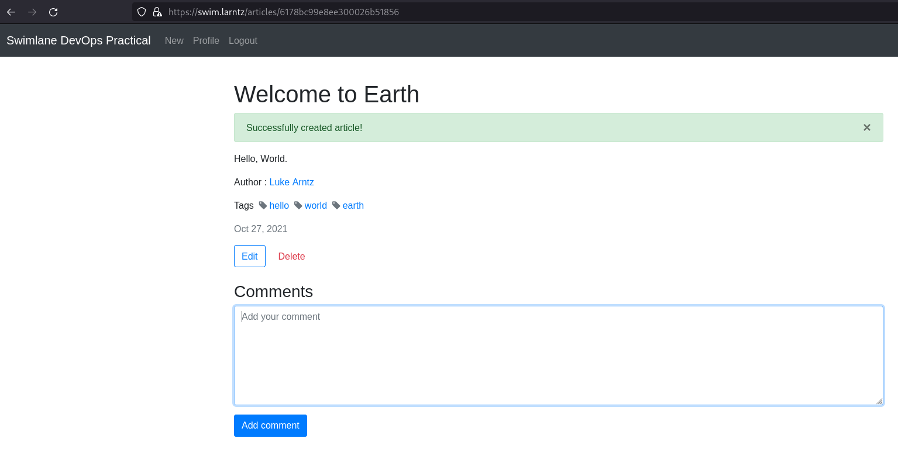

# Contents

  - [Objective](#objective)
  - [Solution](#solution)

# Objective

  - Dockerize https://github.com/swimlane/devops-practical
  - MongoDB should also be deployed as a docker container
  - Create a Helm chart for the application and use Helm (v3) to deploy it to a Kubernetes cluster
  - You can use a hosted service like EKS/GKE/AKS or create your own cluster using Kubespray (https://github.com/kubernetes-sigs/kubespray ) or kURL ( https://kurl.sh/ )
  - Use terraform to create as much of the Kubernetes cluster and required infrastructure as possible

Eliminate as many single points of failure for your Kubernetes cluster deployment as possible

Bonus points for the following:
  - Security
  - Scalability
  - Using Ansible to ensure NTP is installed and running on the worker nodes
     - As well any dependencies needed for Kubernetes if not using EKS/GKE/AKS prebuilt images
  - Using Packer to create the worker node images and applying the Ansible playbook

Access the app running in Kubernetes, register for an account, and add a record.

To deliver your work, create a public Github repository with the following (at a minimum):
  - Readme with the commands used to deploy the Helm chart and Terraform
  - Helm chart
  - Terraform files
  - Dockerfiles
  - Screenshot of the running application with a new record added

If you don't make it through everything here we'd still like to see the progress you made and your thought process on the remaining work.

--- 

# Solution

## overview

This solution will build an HA k8s cluster on libvirt/qemu using the following tools:

  - packer
  - terraform
  - ansible
  - helm (called from ansible)

We will build an haproxy loadbalancer, three contorl plane nodes, and between 2-7 worker nodes. 

### prebuild steps

This was developed and tested on Debian 10. Other distros may have different requirements. Setting up libvirt, qemu, and user permissions is outside the scope of this document. Information to get started setting up KVM on Debian can be found [here](https://wiki.debian.org/KVM)

These commands should be run from a user that can sudo without a password.

1. Install initial debian packages on host system.
    ```
    sudo apt install -y git python3 python3-venv build-essential software-properties-common mkisofs \
      apt-transport-https ca-certificates curl
    ```
1. Clone this code repository.
    ```
    git clone https://github.com/larntz/devops-practical.git devops-practical
    ```
1. Move into the `devops-practical` directory.
    ```
    cd devops-practical
    ```

NOTE: the remaining commands in this README should be executed from the repo's top level directory.

4. Clone the kubespray repository into the `ansible-playbooks` directory.
    ```
    git clone https://github.com/kubernetes-sigs/kubespray.git ansible-playbooks/kubespray
    ```
1. Create a python3 venv and activate it. 
    ```
    python3 -m venv ./venv
    # NOTE: you may need to source a different `activate` file if your shell isn't bash.
    source ./venv/bin/activate 
    ```
1. Install required python packages with pip.
    ```
    pip install -r ansible-playbooks/requirements/requirements.txt -r ansible-playbooks/kubespray/requirements.txt
    ```
1. Install required ansible-galaxy collections.
    ```
    ansible-galaxy install -r ansible-playbooks/requirements/collections.yaml
    ```
1. Install `packer`, `terraform`, `helm`, and `kubectl`.
    ```
    # add hashicorp repositories
    curl -fsSL https://apt.releases.hashicorp.com/gpg | sudo apt-key add -
    sudo apt-add-repository "deb [arch=amd64] https://apt.releases.hashicorp.com $(lsb_release -cs) main"
     
    # add helm repositories
    curl https://baltocdn.com/helm/signing.asc | sudo apt-key add -
    echo "deb https://baltocdn.com/helm/stable/debian/ all main" | sudo tee /etc/apt/sources.list.d/helm-stable-debian.list

    # add kubernetes repo
    sudo curl -fsSLo /usr/share/keyrings/kubernetes-archive-keyring.gpg https://packages.cloud.google.com/apt/doc/apt-key.gpg
    echo "deb [signed-by=/usr/share/keyrings/kubernetes-archive-keyring.gpg] https://apt.kubernetes.io/ kubernetes-xenial main" | sudo tee /etc/apt/sources.list.d/kubernetes.list

    sudo apt update && sudo apt -y install packer terraform helm kubectl
    ```

### build steps

Once the prerequisites are met the entire system can be built using the commands below. 

1. create the vm image with packer.
    ```
    packer build packer/debian.json
    ```
1. deploy vm infrastructure using terraform
    ```
    terraform -chdir=terraform/ init
    terraform -chdir=terraform/ apply -auto-approve
    ```
1. use ansible to configure loadblancer, kubespray vars, and install cert-manager, ingress-nginx, mongodb, and our devops-practical swimapp. 
    ```
    ansible-playbook -i cluster-hosts ansible-playbooks/configure-cluster.yaml
    ```

### cluster access and validation

After the cluster has been deployed and configured the admin kubeconfig file will be located at `ansible-playbooks/kubespray/kubeconfig/admin.conf`. 

Access the cluster via `kubectl` after setting the `KUBECONFIG` environment variable. 

```
export $PWD/ansible-playbooks/kubespray/kubeconfig/admin.conf
kubectl get nodes
```

#### helm commands

The ansible playbook will automatically deploy the helm charts included in this repository, but they can be installed manually with the commands below.

##### mongodb

NOTE: mongodb needs to be installed and ready before installing the application. If the database isn't ready the application will fail to start properly.

install: 

```
```

upgrade:

```
```

##### application

install: 

```
```

upgrade:

```
```

##### ingress-nginx & cert-manager

These charts are from the project's repos.

###### ingress-nginx


###### cert-manager


#### dockerization

The `docker/` directory contains the dockerfile to build the application. 

The commands used to build and push the image are:

```
docker build -t larntz/swim:2021102700 -f Dockerfile.swimapp .
docker push larntz/swim/2021102700
```

#### security summary

- Mongodb is configured to require a login and only allows access to the specified database.
- The application is accessible over HTTPS only. Cert-manager automatically provisions self signed certificates, but in a production envirionment we would use an actually trusted isuser such as let's encrypt.
- When packer is creating the vm images it calls an ansible playbook that installs any available updates. 


#### ha summary

- cluster is deployed with 3 control plane nodes behind an haproxy loadbalancer.
- The mongodb-community-operator is used to deploy mongodb as a cluster. By default we are deployhing 3 members. This can be scaled up and down.
- The application is deployed with 3 replicas. This can be scaled up and down.

HA functionality could be improved using multiple ingress controllers, multiple load balancers with a vip coupled with a service like route53 that can do loadbalancing and health checks. Next steps from there could be a multi-cluster deployment.

#### scalability summary

- both the database cluster and application can be scaled up as needed. 
- TODO: cluster scaling with terraform and kubespray


### screenshots


